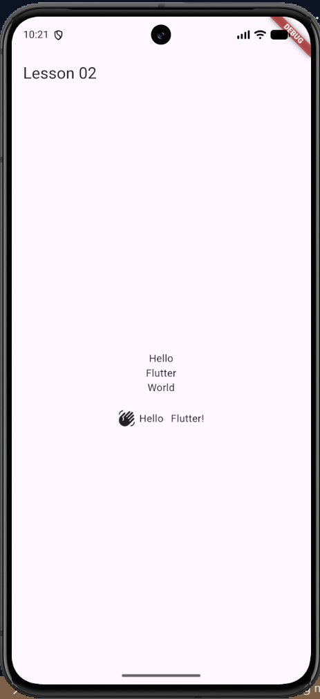

# Lesson 02 – Basic Flutter Widgets

## 📖 Overview

In this lesson, I explored the fundamental Flutter widgets used for building
layouts and arranging UI elements.

I learned how widgets like Column, Row, Center, SizedBox, Text, and Icon
work together to create a Flutter interface.

---

## 📚 Topics Covered

- Column
- Row
- Center
- SizedBox
- Text
- Icon
- Widget hierarchy
- Basic layouts

---

## 🎯 Learning Outcome

After completing this lesson, I understand:

- How Flutter layouts are created using widgets.
- How Column arranges widgets vertically.
- How Row arranges widgets horizontally.
- How Center aligns widgets.
- How SizedBox is used for spacing.
- How multiple widgets are combined to create UI.

---

## 🧩 Mini Project

### Simple Greeting UI

Created a basic interface using:

- Text widgets
- Icon widget
- Column for vertical arrangement
- Row for horizontal arrangement
- SizedBox for spacing

---

## 📱 Screenshot



---

## 📁 Project Structure

```text
lib/
└── main.dart
```

---


## 🔗 Previous Lesson

[Lesson 01 – Flutter App Skeleton](../lesson_01_app_skeleton)

---

## 👨‍💻 Author

Muhammad Huzaifa