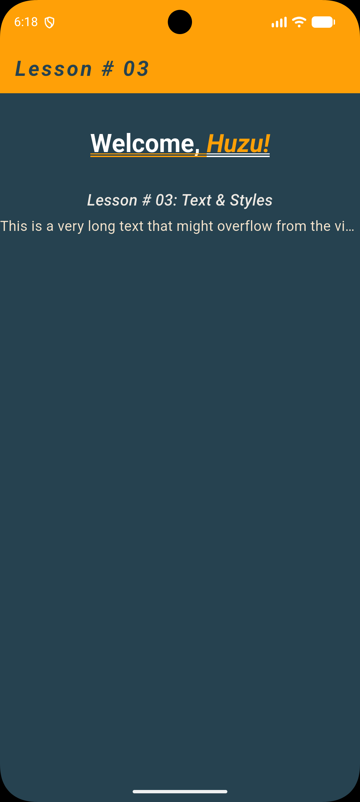
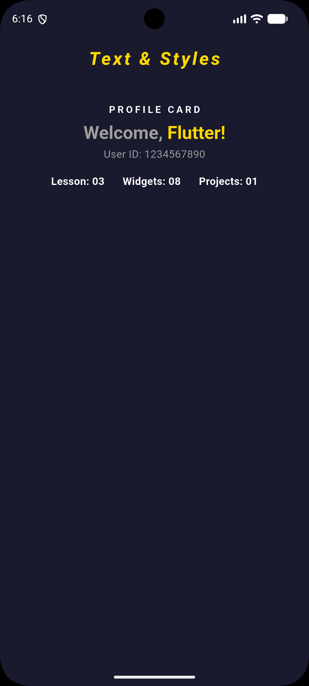

# Lesson 03 – Text & Styles

## 📖 Overview

In this lesson, I explored Flutter's text-related widgets and learned how to
customize text appearance using different styling properties.

I learned how to modify text using `TextStyle`, combine multiple styles using
`RichText` and `TextSpan`, and handle text overflow in Flutter layouts.

---

## 📚 Topics Covered

- Text Widget
- TextStyle
- RichText
- TextSpan
- Font size
- Font weight
- Font style
- Text color
- Letter spacing
- Text decoration
- Text decoration style
- Text scaling
- Text alignment
- Text overflow handling
- maxLines
- Custom colors using Color()
- Column
- Center
- SizedBox

---

## 🎯 Learning Outcome

After completing this lesson, I understand:

- How to style text using `TextStyle`.
- How to customize font properties like size, weight, style, and spacing.
- How `RichText` allows multiple text styles inside a single widget.
- How `TextSpan` is used to apply different styles to different parts of text.
- How to add decorations like underline and customize their styles.
- How to control text scaling using `TextScaler`.
- How to handle long text using `maxLines` and `TextOverflow.ellipsis`.
- How to organize widgets using Column and Center.
- How to define and reuse custom colors.

---

## 🧩 Mini Project

### Text & Styles Showcase

Created a simple UI demonstrating:

- Customized AppBar title
- Styled welcome message using RichText
- Multiple text styles in one widget
- Text decoration examples
- Text overflow handling
- Custom color theme
- Basic layout arrangement

---

## 🎯 Challenge

Created a separate challenge implementation to practice the concepts learned
in this lesson.

The challenge file is located at:

```text
lib/
└── challenges/
    └── challenge.dart
```

To run the challenge instead of the learning screen, update the import in
`main.dart`.

Replace:

```dart
import '../screens/homescreen.dart';
```

with:

```dart
import '../challenges/challenge.dart';
```

---

## 📸 Screenshots

### Learning Screen




### Challenge Solution



---

## 📁 Project Structure

```text
lib/
├── main.dart
│
├── screens/
│   └── homescreen.dart
│
└── challenges/
    └── challenge.dart
```

---

## 🔗 Previous Lesson

[Lesson 01 – Basic App Skeleton](../lesson_01_app_skeleton)
[Lesson 02 – Basic Flutter Widgets](../lesson_02_layout_widgets)

---

## 👨‍💻 Author

Muhammad Huzaifa